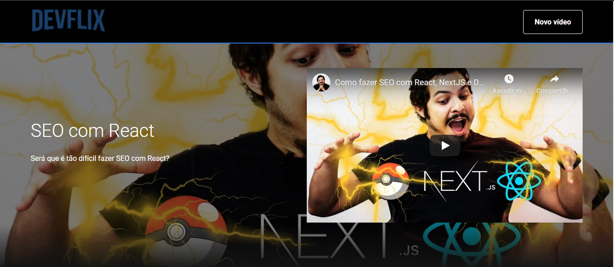

<h1 align="center"> 
    
</h1>

<h1 align="center"> 
    
</h1>

# 📍 Indice
- [Sobre](#-sobre) 
- [Sobre](#-tecnologias) 
- [Como baixar](#-baixar) 
- [Como rodar](#-rodar) 

# 💻 Sobre o projeto
A plataforma **Devflix** tem como finalidade um catálogo virtual, aonde o usuário pode dividir suas preferências em categorias, e em cada categoria se consegue cadastrar os vídeos conforme seu gosto.

Projeto desenvolvido durante a ⚓ **Imersão React** ⚓ - Oferecida pela **Alura**

---

## 🚀 Tecnologias utilizadas
 - [React](https://pt-br.reactjs.org/)
 - [HTML](https://developer.mozilla.org/pt-BR/docs/Web/HTML)
 - [CSS](https://developer.mozilla.org/pt-BR/docs/Web/CSS)
 - [JavaScript](https://www.javascript.com/)

---

## 🚨 Como baixar o projeto
Antes de começar, você vai precisar ter instalado em sua máquina as seguintes ferramentas: Git, Node.js. Além disto ter um editor para trabalhar com o código como VSCode

### 🏁 Para rodar a aplicação 

```bash

    # Clonar o repositório
    $ git clone site

    # Entrar no diretório
    $ cd devflix

    # Instalar as dependências
    $ yarn install

    # Iniciar o projeto
    $ yarn start

```

---
Desenvolvido por Milena Almeida 💙